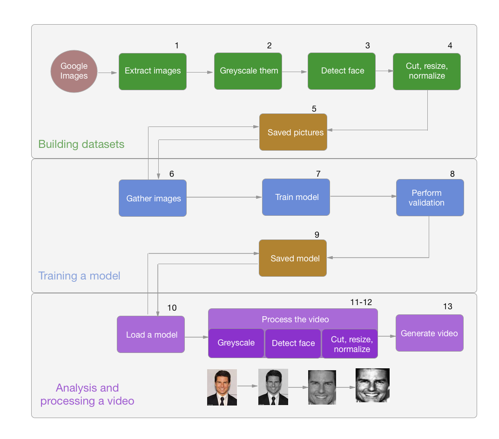
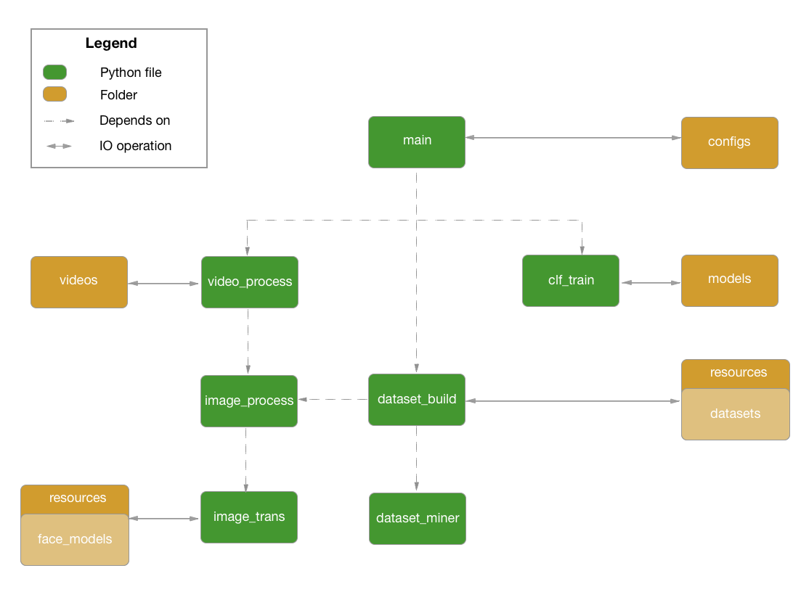
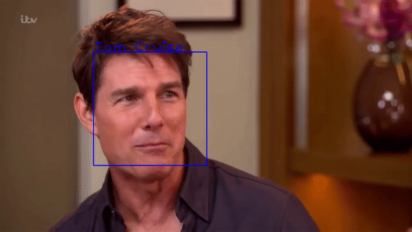

# Face Recognizer
<p align="center">
  
</p>

This project is designed to be a tool for detecting and identifying people in a certain video clip. The identification task is performed using ML models provided by <a href="https://opencv.org">OpenCV</a> and trained with a set of faces images (already provided or extracted from the internet using one of the system functionalities).

The final goal, and the case scenario for this project, is to be able to identify actors in a given movie or TV show episode. This is nothing but the conclusion of a big sequence of intermediate steps until reaching the final outcome.

[<b>Check the example here!</b>](#output-example)

<br>

## How does it work?

### General scheme:
<p align="center">
  
</p>

<b>The datasets containing the face pictures of each person are built</b>:<br>
<t>1. Pictures are extracted from Google Images.<br>
<t>2. Pictures colors are transformed into greyscale.<br>
<t>3. Pictures are search for a face (using a <a href="https://en.wikipedia.org/wiki/Haar-like_feature">HAAR</a> model provided by Intel. Thanks Intel! 👏).<br>
<t>4. If faces are found: cut them and resize them to 100x 100 pixels.<br>
<t>5. Save those pictures in the corresponding person-name folder.<br>

<b>The ML models are trained</b> using those datasets:<br>
<t>6. Gather all the pictures from the desired people.<br>
<t>7. Train the selected model with those samples (Possible algorithms: <i>Eigenfaces</i>, <i>Fishefaces</i> and <i>LBPH</i>).<br>
<t>8. Perform a validation by splitting samples 80-20% to compute model's accuracy.<br>
<t>9. Save the model in the <i>"models"</i> folder.<br>

<b>The video clip is processed</b> given a trained model:<br>
<t>10. Load the trained model.<br>
<t>11. Process the desired video, frame by frame detecting faces on it.<br>
<t>12. For each detected face, cut the image and predict the name using the model.<br>
<t>13. Draw the person's name in that frame and save it in the new video file.<br>

<br>

### Possible algorithms
The main problem with the face identification scenario is that there are thousands of pixel (features). Take for instance a 100x100 pixel image, it has 10.000 pixel values on it! Therefore, the chosen algorithms should perform some kind of feature reduction technique. The algorithms that OpenCV provide are the following:

- <b>Eigenfaces:</b> uses <a href="https://en.wikipedia.org/wiki/Principal_component_analysis">PCA</a> to determine the "Principal Component" (most variance values feature) and thansform the rest to be linear perpendicular to it. This way a big set of correlated features can be transformed into a small set of uncorrelated features.

<p align="center">
  
</p>

- <b>Fisherfaces:</b> uses <a href="https://en.wikipedia.org/wiki/Linear_discriminant_analysis">LDA</a> to find the dimension that better separates the samples between classes. The idea is to build a sub-dimensional space, where samples of similar classes should be represented as close one to another as possible, and as far as possible from different classes samples.

<p align="center">
  
</p>

- <b>Local Binary Patterns Histograms (LBPH):</b> reduces the number of features by creating features that contains summary information about the raw image. THis way the number of features can be reduce, without losing too much information. The most common method to apply this <a href="https://en.wikipedia.org/wiki/Local_binary_patterns">Local Binary Patterns</a> is the following:

<p align="center">
  
</p>

<br>

## What is in the repository?

<p align="center">
  
</p>

The repository contains:

- Set of Python modules:
  - <b>Main:</b> in charge of parsing the execution arguments
  - <b>Dataset_build:</b> in change of building datasets and save them in the `resources` folder.
  - <b>Dataset_miner:</b> contains a set of functions to scrape and extract Google Images.
  - <b>Clf_train:</b> in charge of training models given a configuration file and perform the validation.
  - <b>Video_process:</b> in charge of processing a video frame by frame, and generate an output video.
  - <b>Image_process:</b> contains a set of functions to perform complex operation upon images.
  - <b>Image_trans:</b> contains a set of functions to perform complex operation upon images.

- Set of folders:
  - <b>Configs:</b> contains configuration JSON files, both for scraping and training models.
    - <b>Scraping:</b> contains configuration files for scraping.
    - <b>Training:</b> contains configuration file for training.
  - <b>Models:</b> contains the trained models.
  - <b>Resources:</b>
    - <b>Datasets:</b> contains folder with each people face pictures.
    - <b>Face_models:</b> contains the HAAR face trained models (Thanks again Intel!).
  - <b>Videos:</b> contains the generated output videos.

<br>

## Usage:
The main file from which all functionalities are called is "main.py". The execution syntax is as follows:
```shell
$ python3 main.py <functionality> <arguments>
```

Depending on the chosen mode (<i>build_datasets</i>, <i>train_model</i>, <i>analyse_video</i>), the following arguments are different. The required arguments depending on the selected mode are specified in the next sections:

<br>

### A) Build datasets:
Obtains a set of images from Google Images and saves them in the corresponding folder inside <i>"resources/datasets"</i>. The expected arguments are:

- <b>-d datasets_config:</b> JSON configuration file name inside <i>"configs/scraping"</i>. These files have the following format:
```json
[
  {
    "actor_query": "tom cruise face",
    "pics_numbers": 500
  },
  {
    "actor_query": "julia roberts face",
    "pics_numbers": 500
  }
]
```

For example:
```shell
$ python3 main.py build_datasets -d example.json
```

<br>

### B) Train model:
Trains a OpenCV model given several images datasets. Each dataset must contain pictures of the same person, in order to perform a supervised machine learning process.

The expected arguments are:
- <b>-a algorithm:</b> {<i>Eigen</i>, <i>Fisher</i>, <i>LBPH</i>}
- <b>-d datasets_config:</b> JSON configuration file name inside <i>"configs/training"</i>. These files have the following format:
```json
[
  {
    "label": "Tom Cruise",
    "folder": "tom_cruise_face"
  },
  {
    "label": "Julia Roberts",
    "folder": "julia_roberts_face"
  }
]
```

- <b>-o output:</b> name of the output trained model that will be saved inside <i>"models"</i>.

For example:
```shell
$ python3 main.py train_model -a Eigen -d example.json -o eigen_model
```

<br>

### C) Analyse video:
Finally, once a trained model is available it can be used with a specific video in order to perform the people identification and generate an output video with their names.

The expected arguments are:
- <b>-v video:</b> path to where the video is.
- <b>-m model:</b> name of the trained model inside the <i>"models"</i> folder
- <b>-c confidence:</b> upper bound threshold to which a face is identified as 'Unknown'. <b>Different for each algorithm</b> ⚠️
- <b>-o output:</b> name of the output video.

For example:
```shell
$ python3 main.py analyse_video -v ../videos/Probe.mp4 -m eigen_model -c 600 -o new_video
```

<br>

## Results
### Scalability ⏱

In this section the scalability of the project, regarding the last functionality of the system (analysing a video) is going to be tested. The models were trained using: <b>datasets of 500 pictures from Tom Cruise, Julia Roberts and Johnny Depp.</b>

The video clips used for this testing has been the following:
- Video A: 15 secs, 1280x765 pixels, 29 frames per second, <b>2 actors in scene</b>.
- Video B: 15 secs, 1280x765 pixels, 29 frames per second, <b>3 actors in scene</b>.

The obtained execution times has been obtained using an <b>Intel i5 with 2 cores at 2.4Ghz</b>:

|                           |  Eigenfaces | Fisherfaces |     LBPH     |
| ------------------------- | ----------- | ----------- | ------------ |
| Detection (2 actors)      |    47.14 s  |   47.50 s   |     48.09 s  |
| Normalization (2 actors)  |     0.04 s  |    0.05 s   |     0.04 s   |
| Identification (2 actors) |<b>1.97 s</b>|<b>0.14 s</b>|<b>11.36 s</b>|
| Plotting (2 actors)       |     0.03 s  |     0.03 s  |     0.03 s   |
| Detection (3 actors)      |    48.48 s  |   47.06 s   |     46.96 s  |
| Normalization (3 actors)  |     0.05 s  |    0.05 s   |     0.05 s   |
| Identification (3 actors) |<b>2.63 s</b>|<b>0.17 s</b>|<b>16.75 s</b>|
| Plotting (3 actors)       |     0.03 s  |     0.03 s  |     0.03 s   |

<br>

### Models comparison
The validation of the models was performed by splitting the samples into a 80-20% proportion to compute the accuracy.

|           |  Eigenfaces | Fisherfaces |     LBPH     |
| --------- | ----------- | ----------- | ------------ |
| 2 actors  |     87%     |     63%     |  <b>92%</b>  |
| 3 actors  |     75%     |     54%     |  <b>87%</b>  |

<br>

### Output example
<p align="center">
  
  
</p>

<br>

## Requirements
This project requires Python 3.4 (or superior), as long as some additional packages:
- <a href="https://www.crummy.com/software/BeautifulSoup/bs4/doc/">BeautifulSoup</a>
- <a href="http://www.numpy.org">Numpy</a>
- <a href="https://github.com/opencv/opencv_contrib">OpenCV-contrib</a> (not the just "OpenCV" version) ⚠️
- <a href="https://pillow.readthedocs.io/en/5.1.x/">Pillow</a>
